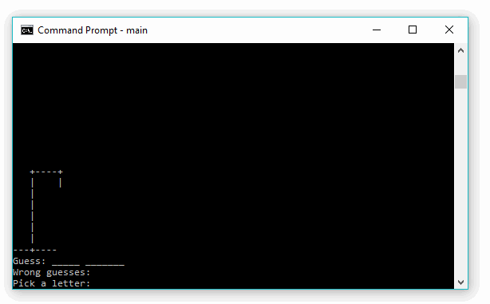

# Hangman Game

Simple hangman game written in C++, written for educational purpose.

Important points about the game:
1. The list of the phrases to be guessed is stored on the file `word_list.txt`.
2. Source of the phrases I use is from https://www.famousscientists.org/
3. No cleaning is done when reading the text file. So you should remove any characters other than a-z and A-Z (in the file `word_list` I have cleaned it manually).



As usual, to build the game just execute

```
g++ --std=c++11 -o main main.cpp
```

